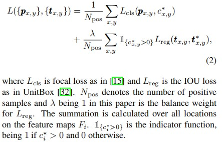

## 论文简读：FCOS: Fully Convolutional One-Stage Object Detection

2019 ICCV

paper is available at: https://arxiv.org/abs/1904.01355

code: https://github.com/tianzhi0549/FCOS，基于[maskrcnn-benchmark](https://github.com/facebookresearch/maskrcnn-benchmark) 和[detectron2](https://github.com/facebookresearch/detectron2)。

论文信息：

Zhi Tian  Chunhua Shen*  Hao Chen  Tong He

The University of Adelaide, Australia

### Abstract

作者提出一种"全卷积单阶段目标检测方法"：FCOS，以逐像素预测方式做目标检测，类似语义分割。

像RetinaNet，SSD，YOLOV3，FasterRCNN这些检测器几乎都依赖于预先设定的anchor，基于anchor的检测器在训练过程中，需要大量的IoU计算，而且人为的设定anchor尺寸，使得检测器对目标size变得更加敏感。

FCOS没有使用anchor，而是仅仅在后处理阶段使用了非极大值抑制。使用ResNeXt-64x4d-101作为骨干网的FCOS实现了44.7%的AP。

### 1 Introduction

基于anchor的检测器具有以下缺点：

1. 检测器对于特定尺寸、纵横比的anchor特别敏感，而且固定的anchor尺寸，也降低了检测器的泛化能力；
2. 为了实现更高的召回率，基于anchor的检测器训练过程中，产生大量的anchor，比如在FPN中，一张短边为800的图像，大约产生180K个anchor，而且大部分是负样本；
3. 计算大量anchor的IoU，所需计算量极大。

FCN网络在语义分割、深度估计、关键点检测，密度估计等任务中取得了极大成功。能否用基于逐像素预测的方式，来做目标检测呢？答案是肯定的。基于FCN的目标检测框架（如DenseBox），为每个特征图空间位置预测出一个4维向量和1个类别：4维向量描述了边界框较于该中心点的相对偏移，为了处理不同大小的边界框，DenseBox将特征图调整到固定大小，但对于高度重叠的边界框，回归将产生模糊性，为了解决这个问题，作者引入了特征金字塔网络FPN。

在消除重叠边界框回归的模糊性之后，FCOS已经的精度已经达到了传统的基于anchor的检测器。此外作者观察到，在远离目标中心点的位置，产生了一些低质量的预测边界框，为了能抑制掉，作者引入了一个"center-ness"分支（只有一层）来预测像素位置与其对应的边界框中心之间的偏差值，使用该值过滤低质量的检测框。

FCOS具有以下优势：

+ 无anchor，较少计算量；
+ FCOS可以用于两阶段检测器网络中的RPN部分；
+ 微调FCOS，就可以用于实例分割和关键点检测。

### 2 Related Work

anchor-free detectors

FCOS利用ground truth边界框中所有的点来预测边界框（这里的“所有的点”，应该指的是对应特征图上区域上的所有的空间位置点？），而低质量的边界框被“center-ness”分支所抑制。因此，FCOS能够提供与基于anchor的检测器相近的召回率。

### 3 Approach

+ FCOS: 以逐像素预测的方式重新定义目标检测。

+ FPN: 利用多层次的预测来提高召回率和解决由重叠的边界框所产生的模糊性。

+ Center-ness 分支，以抑制低质量检测边界框。

#### FCOS

令$F_{i}\in R^{H×W×C}$ 表示第$i$层特征图（因为加入了FPN，所以从骨干网中得到的是多个特征图），令$s$表示步长。

输入图像的GT边界框表示为：
$$
B_{i}=(x0,y0,x1,y1,c) \; \in R^4 × {1,2,...,C}
$$
 C表示类别数，COCO数据集中，C=80，其它：左上角坐标和右下角坐标，类别数。

于是，对于特征图$F_i$上的位置$(x,y)$，使用以下公式，将它投影到输入图像：
$$
(
\lfloor\frac{s}{2}\rfloor + x*s,
\lfloor\frac{s}{2}\rfloor + y*s
)
$$

作者直接在位置$(x,y)$上做边界框回归。

> we directly regress the target bounding box at the location. In other words, our detector directly views locations as *training samples* instead of anchor boxes in anchor-based detectors, which is the same as FCNs for semantic segmentation [20].

Location$(x,y)$如果落在任意GT边界框内，就认为是正样本，而且该位置的类别标签$c^*$就是该GT边界框的标签。如果$c^*=0$，就归为负样本。除了类别标签，还有该位置对应的regression targets: 4维向量$t^*=(l^*,t^*,r^*,b^*)$ 。如果一个location落在多个GT边界框的重叠部分，就归为模糊样本。

> Specififically, location (x, y) is considered as a positive sample if it falls into any ground-truth box and the class label c of the location is the class label of the ground-truth box. Otherwise it is a negative sample and c = 0 (background class). 
>
> Besides the label for classifification, we also have a 4D real vector 
>
> $t^* = (l^*, t^∗, r^*, b^∗)$ being the regression targets for the location. Here$(l^*, t^∗, r^*, b^∗) $are the distances from the location to the four sides of the bounding box, as shown in Fig. 1 (left). 
>
> If a location falls into multiple bounding boxes, it is considered as an *ambiguous sample*.

GT边界框左上角和右下角的坐标为$(x0,y0,x1,y1)$，则location$(x,y)$的regression targets$(l^*,t^*,r^*,b^*)$计算如下：
$$
l^* = x-x0,\; t^* = y-y0, \\
r^* = x1-x,\; b^* = y1-y.
\tag{1}
$$
FCOS可以利用尽可能多的前景样本来训练回归器。

> *It is worth noting that FCOS can leverage as many foreground samples as possible to train the regressor.* 
>
> It is different from anchor-based detectors, which only consider the anchor boxes with a highly enough IOU with ground-truth
>
> boxes as positive samples. We argue that it may be one of the reasons that FCOS outperforms its anchor-based counterparts.

**Network Output**

FCOS网络结构图如下。

网络输出：80维向量$p$ 和4维向量$t=(l,t,r,b)$ 。然后作者训练了C个二分类器。

在骨干网后面加入了4个卷积层，后2个卷积层分别用于分类和回归。

由于regression targets是正数，所以作者使用$exp(x)$ 将回归分支的输出值映射到$(0,+∞)$ 。

**Loss Function**

训练时用的损失函数如下：

**Inference** 输入一张图片，网络输出classification scores $p_{x,y}$ 和regression prediction $t_{x,y}$ ，使用公式(1)转换坐标。

> The inference of FCOS is straightforward.
>
> Given an input images, we forward it through the network and obtain the classification scores $p_{x,y}$ and the regression prediction $t_{x,y}$ for each location on the feature maps $F_i$. Following [15], we choose the location with $p_{x,y} > 0.05$ as
>
> positive samples and invert Eq.(1) to obtain the predicted
>
> bounding boxes.

#### Multi-level Prediction with FPN for FCOS

多级FPN解决了两个问题：large stride导致的低BPR问题、GT边界框重叠导致的模糊样本问题。

> 1) The large stride (*e.g.*, 16*×*) of the final feature maps in a CNN can result in a relatively low best possible recall (BPR). with multi-level FPN prediction [14], the BPR can be improved further to match the best BPR the anchor-based RetinaNet can achieve. 
>
> 2) Overlaps in ground-truth boxes can cause intractable ambiguity, which bounding box should a location in the overlap regress? This ambiguity results in degraded performance of FCN-based detectors. In this work, we show that the ambiguity can be greatly resolved with multi-level prediction, and the FCN-based detector can obtain on par, sometimes even better, performance compared with anchor-based ones.

FCOS加入FPN之后，可以在不同尺度的特征图上，实现检测不同尺度的目标。作者定义了5种不同尺度的特征图，输出特征图的卷积层，步长分别为8，16，32，64和128。作者直接限制每级特征图所回归的边界框的尺寸范围，即在不同尺寸的特征图上做边界框回归时，对于特定尺寸的特征图，只能产生特定尺寸范围内的边界框，超过这个范围的，将被归为负样本。5个特征图，回归的边界框尺寸分别限制在：0，64，128，256，512，$∞$ 范围。

> Unlike anchor-based detectors, which assign anchor boxes with different sizes to different feature levels, we directly limit the range of bounding box regression for each level. More specifically, we firstly compute the regression targets$(l^*, t^∗, r^*, b^∗)$ for each location on all feature levels. Next, if a location satisfies $max(l^*, t^∗, r^*, b^∗) > m _i$ or $max( l^*, t^∗, r^*, b^∗)*< m_{i-1}$, it is set as a negative sample and is thus not required to regress a bounding box any more. Here $m_i$ is the maximum distance that feature level $i$ needs to regress. 
>
> In this work, $m2, m3, m4, m5, m6$ and $m7$ are set as 0, 64, 128, 256, 512 and $∞$, respectively. Since objects with different sizes are assigned to different feature levels and most overlapping happens between objects with considerably different sizes. 
>
> If a location, even with multi-level prediction used, is still assigned to more than one ground-truth boxes, we simply choose the ground truth box with minimal area as its target. 
>
> As shown in our experiments, the multi-level prediction can largely alleviate the aforementioned ambiguity and improve the FCN-based detector to the same level of anchor-based ones.

不同尺度的特征图，共享同一个head，可以使检测器参数更加高效，但是不同尺寸特征图的回归范围是之前有限制的，所以不能继续使用 $exp(x)$ ，于是作者加入了一个可训练的标量$s_{i}$ 来自动调整，即$ exp(s_i *x)$ 。

>  However, we observe that different feature levels are required to regress different size range (*e.g.*, the size range is [0*,* 64] for *P*3 and [64*,* 128] for *P*4), and therefore it is not reasonable to make use of identical heads for different feature levels. As a result, instead of using the standard exp(*x*), we make use of exp(*s**i**x*) with a trainable scalar $s_i$ to automatically adjust the base of the exponential function for feature level $P_i$ , which slightly improves the detection performance.

#### Center-ness for FCOS

作者在加入multi-level 之后，发现与anchor based的检测器之间还有一定差距，问题在于：远离目标中心点的location产生了大量的低质量边界框。于是作者提出了一个单层平行分支，用于预测Location的Center-ness。

> The center-ness depicts the normalized distance from the location to the center of the object that the location is responsible for.

对于location $(x,y)$的regression targets $(l^*,t^*,r^*,b^*)$  ，center-ness target定义为：
$$
centerness^*=\sqrt{\frac{min(l^*,r^*)}{max(l^*,r^*)} × \frac{min(t^*,b^*)}{max(t^*,b^*)}} 
\tag{3}
$$
center-ness范围为0到1，所以训练过程中使用二值交叉熵损失 (binary cross entropy loss)。测试过程中，用于检测框排序的最终score，由预测的center-ness值和分类值相乘得到。

> When testing, the final score (used for ranking the detected bounding boxes) is computed by multiplying the predicted center-ness with the corresponding classification score. Thus the center-ness can down-weight the scores of bounding boxes far from the center of an object. As a result, with high probability, these low quality bounding boxes might be filtered out by the final non-maximum suppression (NMS) process, improving the detection performance *remarkably*. 

### 4 Experiments & Conclusion

作者在COCO数据集上训练和测试。

一些实验结果和消融实验，此处跳过。

作者还用FCOS代替faser rcnn的RPN，结果是使$AR^{100}$提升了18%，$AR^{1k}$ 提升了3.4%。

